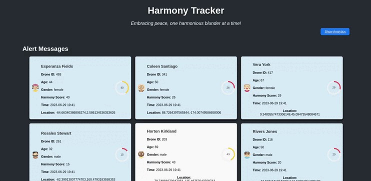

<!-- PROJECT LOGO -->
<br />
<div align="center">
  <h1 align="center">Harmony State</h1>
  
</div>

<!-- TABLE OF CONTENTS -->
<details>
  <summary>Table of Contents</summary>
  <ol>
    <li>
      <a href="#about-the-project">About The Project</a>
      <ul>
        <li><a href="#built-with">Built With</a></li>
      </ul>
    </li>
    <li>
      <a href="#getting-started">Getting Started</a>
      <ul>
        <li><a href="#prerequisites">Prerequisites</a></li>
        <li><a href="#installation">Installation</a></li>
      </ul>
    </li>
    <li><a href="#usage">Usage</a></li>
    <li><a href="#license">License</a></li>
    <li><a href="#contact">Contact</a></li>
  </ol>
</details>


<!-- ABOUT THE PROJECT -->
## About The Project


Harmonyland is a blessed country, led by an affable and clear-sighted ruler. He
takes great pride in its effort to bring peace, happiness, and harmony to all its
citizens.
To do so, the benevolent ruler heavily rely on his fellow harmonymakers. A
governmental agency dedicated to spread harmony around the country. To reach
their ambition, they bring assistance to any agitated person and help them to
recover peace and harmony. More generally they help citizen to stay in line with
their country harmonious goal
To help its harmonymakers squads, Harmonyland engineers have created a
working autonomous drone called harmonywatcher.
They need you to create the program that will receive and manage
harmonywatchers’s data.
This program must
- store every harmonywatcher data
- trigger alerts
- enable harmonymaker officers to perform analysis on harmonywatcher data


### Built With

* ![Kafka][Kafka.js]
* ![Scala][Scala.js]
* ![React][React.js]

## Overview
  


<!-- GETTING STARTED -->
## Getting Started
### Prerequisites

You need `sbt` installed.
You need `kafka` installed : https://www.apache.org/dyn/closer.cgi?path=/kafka/2.5.0/kafka_2.12-2.5.0.tgz

You need to install npm and the following react library: styled-components, react-avatar, react-circular-progressbar, react-router-dom, chart.js, react-chartjs-2

* npm
  ```sh
  npm install
  ```
  ```sh
  npm install styled-components react-avatar react-circular-progressbar react-router-dom chart.js react-chartjs-2
  ```

### Installation

1. Clone the repo
   ```sh
   git clone https://github.com/DjuloFyro/HarmonyState.git
   ```
   
<!-- USAGE EXAMPLES -->
## Usage

- In the kafka directory
    1. Start zookeeper for kafka
    ```sh
    bin/zookeeper-server-start.sh config/zookeeper.properties
    ```
    2. Lauch kafka server
    ```sh
    bin/kafka-server-start.sh ./config/server.properties
    ```
- In the HarmonyState directory
    1. Lauch the Harmony watchers simulation
    ```sh
    sbt "project harmonywatcher_simulation" "run"
    ```
    2. Lauch the alerts triger
    ```sh
    sbt "project trigger_alert" "run"
    ```
    3. Lauch the alerts handler
    ```sh
    sbt "project handle_alerts" "run"
    ```
    4. (optionnal) Lauch the storage to a database
    ```sh
    sbt "project storage" "run"
    ```
    5. Lauch the analytics
    ```sh
    sbt "project analytics" "run"
    ```
    6. Run the web app
    ```sh
    cd alert-app
    npm start
    ```
    The app will be available at [localhost:3000](http://localhost:3000/) 


For the step 4 and 5 you need to put your access keys from aws:
```scala
val accessKey = ""
val secretKey = ""
```

<!-- LICENSE -->
## License

Distributed under the MIT License. See `LICENSE.txt` for more information.


<!-- CONTACT -->
## Contact

- Julian Gil - juliangil2424@gmail.com
- Habib Adoum Mandazou - habib-adoum.mandazou@epita.fr
- Antoine Feret - antoine.feret@epita.fr


<!-- MARKDOWN LINKS & IMAGES -->
<!-- https://www.markdownguide.org/basic-syntax/#reference-style-links -->
[Kafka.js]: https://img.shields.io/badge/kafka-20232A?style=for-the-badge&logo=kafka&logoColor=white
[Scala.js]: https://img.shields.io/badge/Scala-20232A?style=for-the-badge&logo=scala&logoColor=61DAFB
[React.js]: https://img.shields.io/badge/React-20232A?style=for-the-badge&logo=react&logoColor=blue
